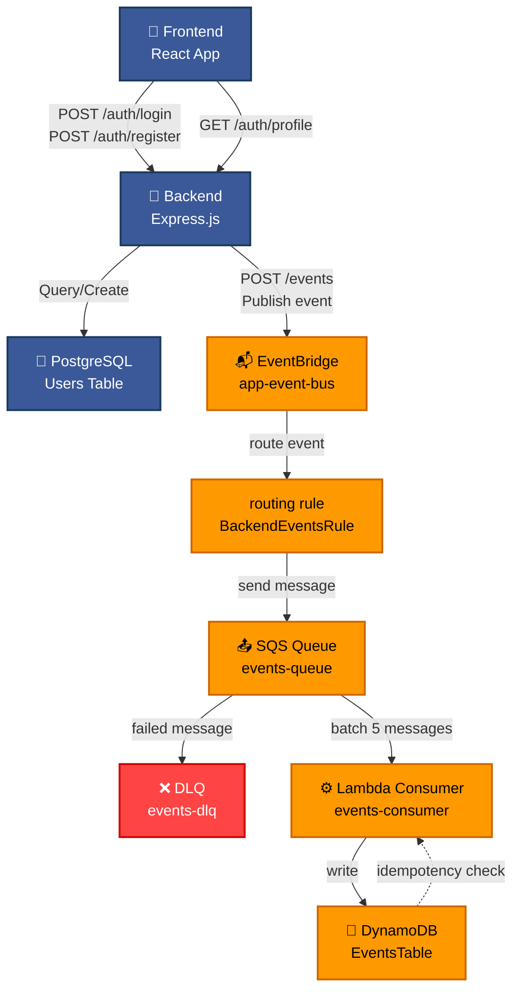

# AWS Repo Project

User login and registration application with AWS-based architecture.

## 🏗️ Application Architecture



## 📁 Project Structure

```
aws-repo-project/
├── backend/              # Express.js API
│   ├── src/
│   │   ├── routes/       # API endpoints
│   │   ├── middleware/   # Auth middleware
│   │   ├── infrastructure/  # Logger
│   │   └── lib/          # Prisma client
│   └── prisma/           # Database schema & migrations
│
├── frontend/             # React application
│   ├── src/
│   │   ├── pages/        # Login, Register, Dashboard
│   │   ├── components/   # Reusable components
│   │   ├── api/          # API calls
│   │   ├── hooks/        # Custom React hooks
│   │   └── schema/       # Zod validation schemas
│
├── infra/                # AWS CDK Infrastructure
│   ├── lib/              # CDK stack definition
│   ├── lambda/           # Lambda functions
│   └── bin/              # CDK entry point
│
└── docker-compose.yml    # LocalStack, PostgreSQL, DynamoDB
```

## Quick Start

### Requirements

- Node.js 20.x
- Docker (for LocalStack, PostgreSQL)
- AWS CLI

### 1. Installation

```bash
# Backend
cd backend
npm install

# Frontend
cd ../frontend
npm install

# Infrastructure
cd ../infra
npm install
```

### 2. Running the Application

```bash
# Start Docker
docker compose up -d

# Backend (in a separate terminal, from backend/ directory)
npm run dev

# Frontend (in a separate terminal, from frontend/ directory)
npm start
```

Application available at: `http://localhost:3000`
Backend available at: `http://localhost:3001`

## Documentation

- [Backend README](./backend/README.md) — API details
- [Frontend README](./frontend/README.md) — UI details
- [Infra README](./infra/README.md) — AWS CDK & LocalStack setup

## Key Features

✅ **Login & Registration** — JWT tokens + refresh mechanism
✅ **Password Reset** — Reset links with time-limited tokens
✅ **Validation** — Frontend (Zod) + Backend
✅ **Error Handling** — Global Axios interceptor
✅ **Monitoring** — CloudWatch Logs (LocalStack)
✅ **Security** — bcrypt hashing, httpOnly cookies, CORS

## Tech Stack

### Backend

- Express.js
- Prisma ORM
- PostgreSQL
- JWT
- AWS SDK

### Frontend

- React
- Material-UI
- React Hook Form
- Zod (validation)
- Axios
- React Hot Toast

### Infrastructure

- AWS CDK
- AWS EventBridge
- AWS SQS
- AWS Lambda
- AWS DynamoDB
- AWS CloudWatch Logs
- Docker
- PostgreSQL
